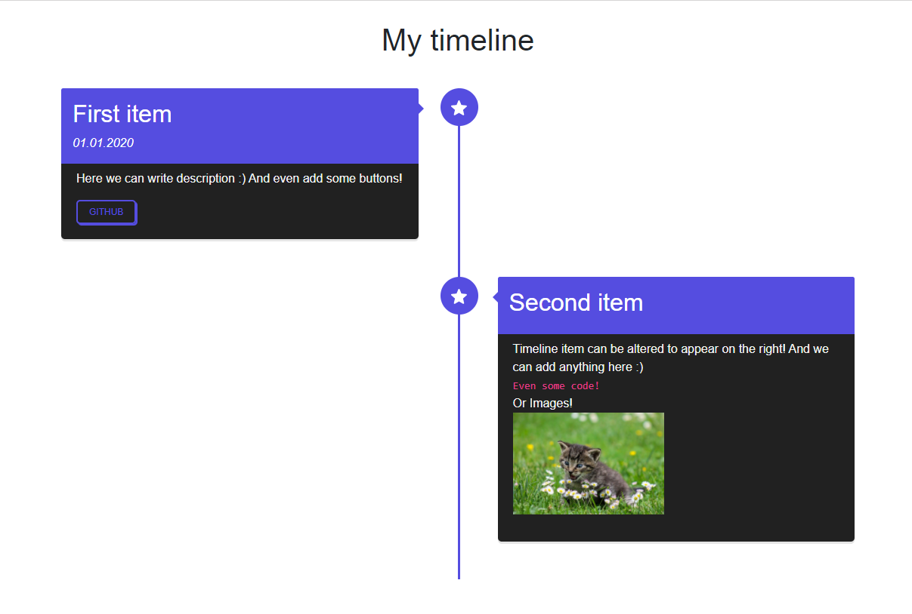
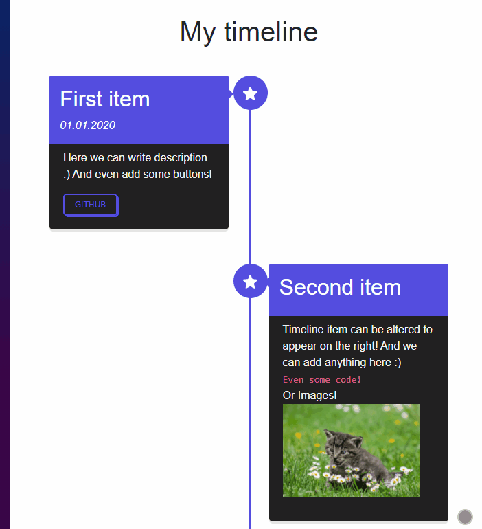

[](https://github.com/Morasiu/BlazorTimeline/blob/master/LICENSE)
[](https://www.nuget.org/packages/BlazorTimeline/)


# BlazorTimeline
Simple timeline component for Blazor



## It's responsive!



## Features

* ✅ Simple component
* ✅ Color customization
* ✅ Responsive!
* ✅ You can put anything in the description!

> Checkout [CHANGELOG](CHANGELOG.md) for more info.

## Usage

### 1. Install from [Nuget](https://www.nuget.org/packages/BlazorTimeline/)

### 2. Add using to your project.

```html
@using BlazorTimeline
```

### 3. Example code
```html
@using BlazorTimeline

<Timeline
    Title="My timeline"
    TitleBgColor="#554DE0"
    TitleColor="#FFFFFF"
    TextColor="#F3F3F3"
    TextBgColor="#212121"
    ItemPositionOption="@ItemPositionOption.AutoAltering">
    
    <TimelineItem Title="First item" Time="01.01.2020" ButtonText="Github" Link="https://github.com/">
        Here we can write description :) And even add some buttons!
    </TimelineItem>

    <TimelineItem Title="Second item">
        <span>Timeline item can be altered to appear on the right! </span>

        <span>And we can add anything here :)</span> <br/>

        <code>Even some code!</code> <br/>

        <span>Or Images!</span> <br/>

        
    </TimelineItem>
</Timeline>
```

> There is also a [demo project](https://github.com/Morasiu/BlazorTimeline/tree/master/BlazorTimeline/Demo) in repo.

### Final notes

> If you know some CSS magic I would totally appreciate help to clean up my CSS.


## Thanks

Thanks [Bruno Rodrigues](https://github.com/itbruno) for that code sample! 

[SAMPLE](https://codepen.io/itbruno/pen/KwarLp/?editors=1100)

## License

This project is licensed under the MIT License - see the [LICENSE](LICENSE) file for details

<a href="https://www.buymeacoffee.com/morasiu" target="_blank"></a>
